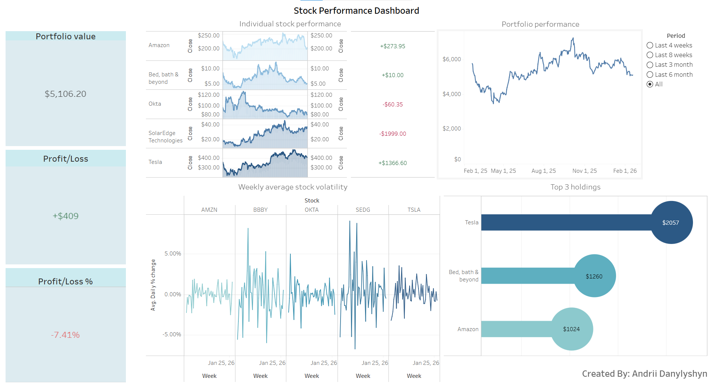

# Stocks dataset Tableau visualisation
> Tableau dashboard build for visualization of changes in stock prices and portfolio revenue

## Overview

This repository contains Tableau dashboard that provides data visualization and metrics of 5 different stocks and profit or loss of created portfolio based on stocks.
Current project contains some basic interactions with Tableau and contains following charts:
* Stock performance chart
* Profit / Loss chart
* Portfolio line chart
* Lollipop chart
* Volatility chart

## Prerequisites

To run this project you'll just need Tableau installed on your desktop.
Or if you just want to see dashboard you can follow this [Link](https://public.tableau.com/app/profile/andrii.danylyshyn/viz/Stocks_17717676907260/Stocksperformance?publish=yes)

